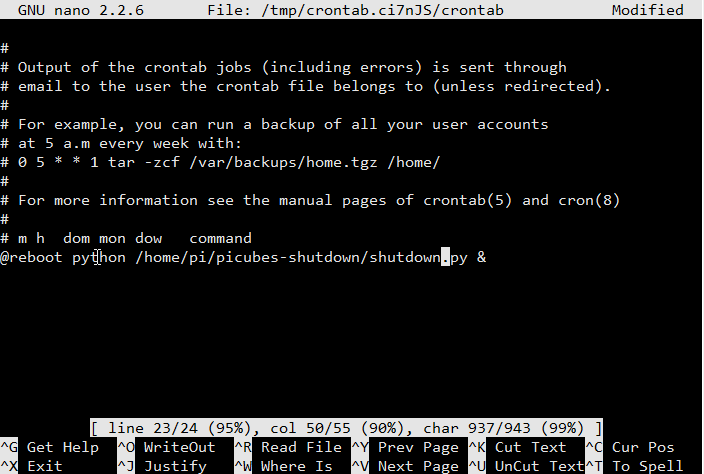

## picubes-shutdown    

This is the Python script to execute safe shutdown in the case of power loss.

## Installation

First make sure that I2C is enabled on the Raspberry Pi:

[Follow instructions on our Blog how to do enable I2C](http://www.cube-controls.com/blog/how-to-enable-i2c-on-raspberry-pi)

Install smbus Python library:

	$ sudo apt-get install python-smbus

Download shutdown script from GitHub:

    $ git clone https://github.com/Cube-Controls/picubes-shutdown.git

Edit Crontab:
	
	$ sudo crontab -e 

Using cursor keys scroll to the bottom and add next line:

	@reboot python /home/pi/picubes-shutdown/shutdown.py &

In the case that The ThingBox Node-RED image is used and "root" user name to login:
	
	@reboot python /root/picubes-shutdown/shutdown.py &

To save these changes click “CTRL-X”, then “Y” and finally “Return”. You should now be back at the command prompt.

Reboot Raspberry Pi using :

	$ sudo reboot

After Raspberry Pi starts up to test script power plug can be unplugged , after 10 seconds script will start safe shutdown procedure and Raspberry Pi will shut down.

Please note that JP1 jumper on the Pi-Cubes Main board has to be in the BAC(Backup) position in order to provide power from
backup capacitors to the Raspberry Pi.

License
----

MIT 

 
	

